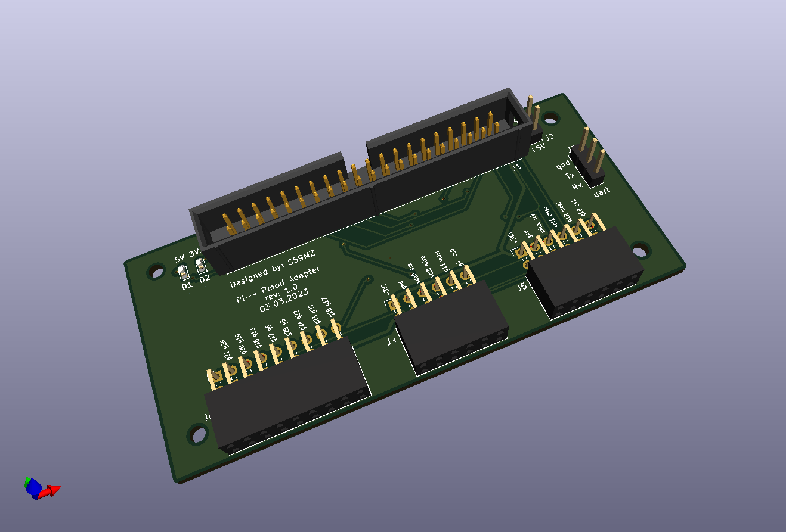
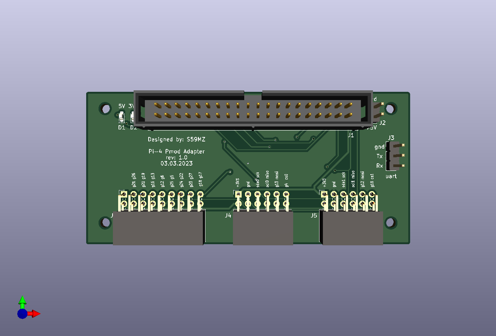
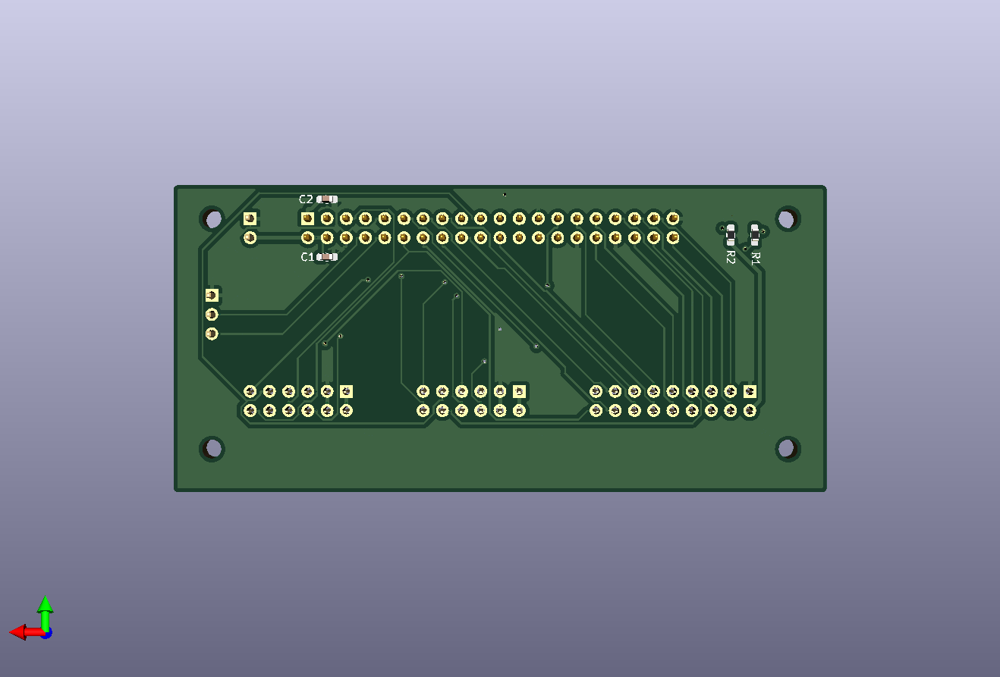

# pi4_pmod
Raspbery Pi-4 Adapter for Pmod modules

Schematic:
[pi4_pmod.pdf](pi4_pmod.pdf)

BOM:
[pi4_pmod.csv](pi4_pmod.csv)

Gerbers:
[gerbers.zip](https://github.com/s59mz/kicad-pi4-pmod/raw/main/gerbers.zip)
